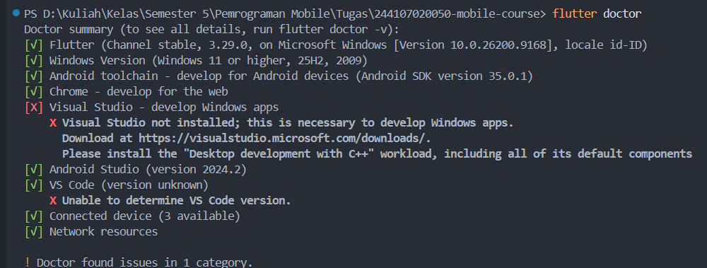

Checklist verifikasi
    flutter doctor tidak memiliki masalah yang menghambat target Android. ✅ 
    flutter devices mendeteksi emulator/perangkat fisik.✅ 
    Aplikasi berjalan dan UI default telah diganti dengan profil sederhana.✅ 
    Anda dapat menjelaskan perbedaan hot reload dan hot restart.✅
    Repository remote berisi source code, README, screenshot, dan riwayat commit.✅

Refleksi
    Kapan native lebih tepat dipilih daripada cross-platform?
    -> Native lebih tepat dipilih ketika aplikasi membutuhkan performa tinggi, akses mendalam ke fitur perangkat, atau integrasi khusus dengan sistem operasi yang sulit dicapai secara optimal melalui cross-platform.
    Bagaimana perubahan state berhubungan dengan widget tree dan UI deklaratif?
    -> Perubahan state dalam UI deklaratif akan memengaruhi tampilan karena ketika state berubah, framework akan memperbarui widget yang terkait sehingga UI otomatis menampilkan kondisi terbaru.
    Mengapa commit kecil dengan pesan jelas bermanfaat bagi pekerjaan tim dan portfolio?
    -> Commit kecil dengan pesan yang jelas memudahkan tim memahami dan melacak perubahan, memperbaiki kesalahan, serta menunjukkan proses kerja yang rapi dan profesional dalam portfolio.