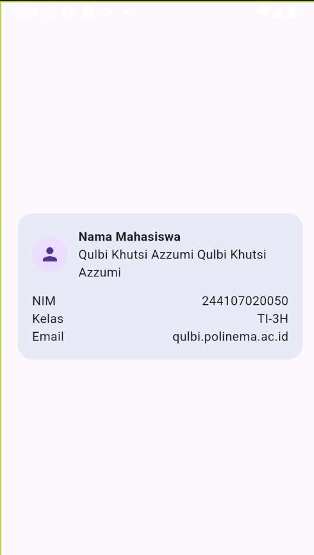

## 4. Praktikum: Layout Sederhana (Warm-up)

### Eksperimen Warm-up

1. Hapus Expanded pada baris nama, lalu amati peringatan overflow atau perilaku layout-nya; kembalikan setelah itu.

   Setelah Expanded dihapus, jika konten melebihi batas ruang yang tersedia maka dapat muncul peringatan overflow.

2. Ganti mainAxisSize: MainAxisSize.min menjadi nilai default dan amati perubahan tinggi kartu.

   MainAxisSize.min` membuat Column memiliki ukuran sesuai dengan kontennya sehingga card tidak mengambil ruang vertikal berlebihan.

3. Tambahkan satu baris data (misalnya Email) menggunakan pola Row + Expanded yang sama.
