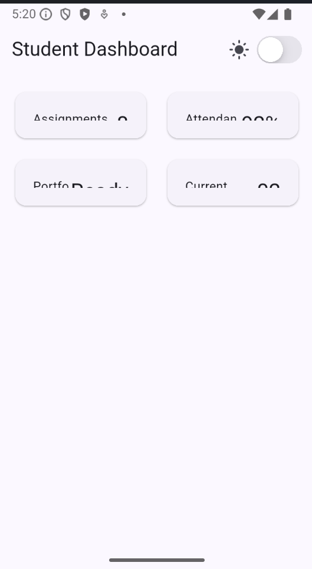
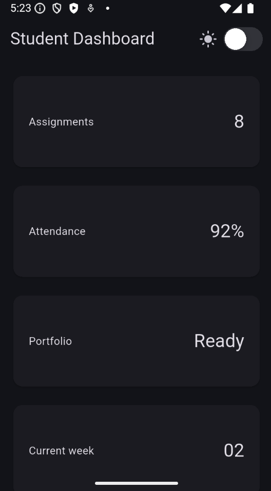
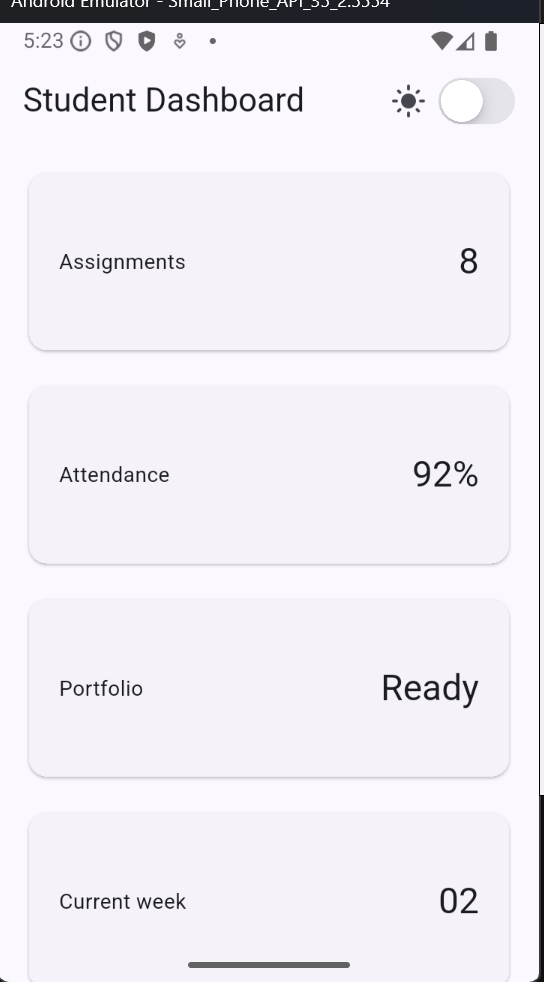
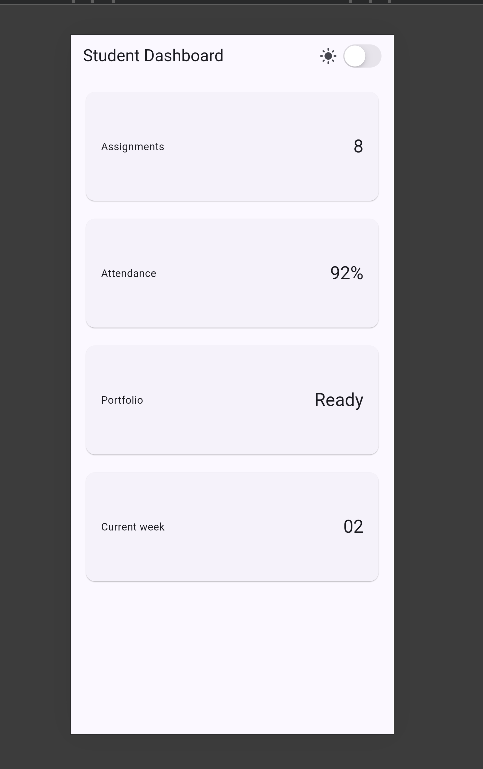
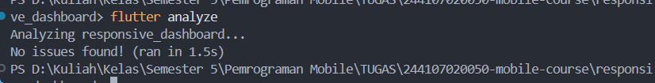
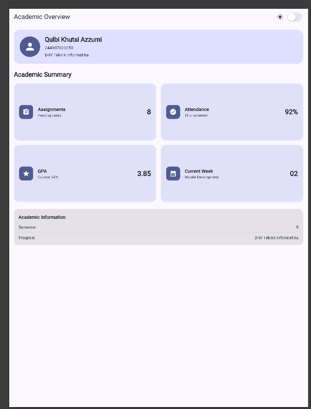
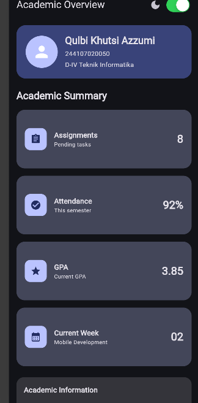
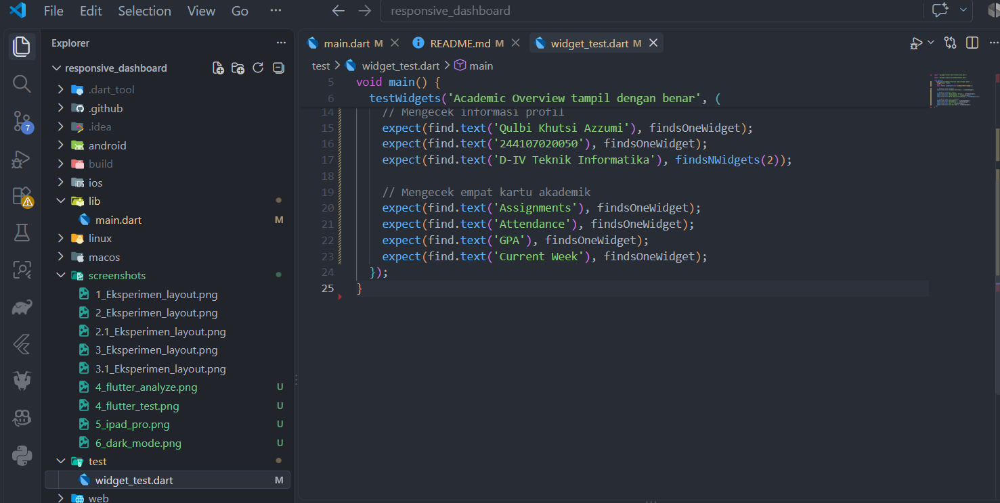

## Eksperimen layout

1. Ubah breakpoint dari 700 menjadi nilai lain dan amati perubahan jumlah kolom.

Jika lebar layar kurang dari 500, dashboard memiliki 1 kolom.
Jika lebar layar 500 atau lebih, dashboard memiliki 2 kolom.

2. Ubah themeMode menjadi ThemeMode.dark, lalu kembalikan ke ThemeMode.system.

 -> mode gelap
Aplikasi akan selalu menggunakan Dark Mode, meskipun switch diubah.

 -> mode default sistem
aplikasi akan mengikuti tema perangkat, apakah perangkat sedang menggunakan Light Mode atau Dark Mode.

3. Uji aplikasi dengan ukuran layar emulator yang berbeda.

 -> iphone 15 promax
 -> iphone 16 promax

4. Tambahkan Semantics atau label yang bermakna pada elemen yang penting bagi screen reader.

Widget Semantics ditambahkan pada switch tema dan kartu dashboard. Hal ini membantu screen reader memberikan informasi yang lebih jelas mengenai fungsi dan isi elemen kepada pengguna.

## Tugas dan AI design exploration

1. flutter analyze tidak menghasilkan error.

2. flutter test lulus semua widget test responsif.

3. Aplikasi dapat dijalankan pada ukuran layar sempit dan lebar.

 -> iphone 15 promax
 -> ipad pro

4. Dark mode memiliki kontras dan teks yang terbaca.

5. Struktur widget dapat dijelaskan saat code review.

AcademicOverviewApp adalah root widget aplikasi. Di dalamnya terdapat MaterialApp untuk mengatur tema dan halaman utama. Halaman utama menggunakan Scaffold yang menyediakan struktur dasar seperti AppBar dan body.

6. Screenshot, folder test/, dan README sudah tersimpan pada folder tugas Week 2.

