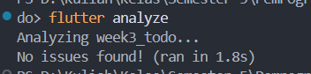
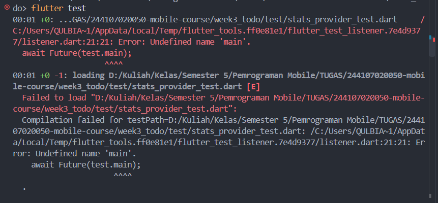

# Praktikum 3 — Uji ketiga state
1. Salin kode di atas ke project ToDo Anda (atau project terpisah) dan jalankan. Amati tampilan loading selama 2 detik pertama.

Aplikasi menampilkan loading terlebih dahulu, kemudian menampilkan daftar data setelah proses pemuatan selesai.

2. Ubah build() sementara untuk melempar error: throw Exception('Gagal terhubung ke server');. Jalankan dan amati UI error beserta tombol Coba lagi.

State error digunakan untuk memberikan informasi kepada pengguna bahwa data gagal dimuat dan menyediakan pilihan untuk mencoba kembali.

3. Tekan tombol Coba lagi, ref.invalidate membuat provider dijalankan ulang. Pulihkan kode, pastikan state success tampil.

ref.invalidate() dapat digunakan untuk memicu provider agar melakukan proses pemuatan ulang dari awal.

4. Refleksikan: mengapa menampilkan ulang data lama (stale data) dengan indikator refresh kadang lebih baik daripada mengosongkan layar? Kapan pola itu penting?

Menampilkan data lama (stale data) dengan indikator refresh terkadang lebih baik daripada mengosongkan layar karena pengguna masih dapat melihat informasi yang sebelumnya sudah tersedia selama data baru sedang dimuat.
Pola stale data penting ketika proses pemuatan data membutuhkan waktu, koneksi internet tidak stabil, atau data sebelumnya masih cukup relevan untuk digunakan sementara. Contohnya pada aplikasi berita, dashboard, media sosial, atau daftar transaksi.

# Sebelum kode AI diterima, verifikasi hal berikut dan catat temuan Anda di README:

1. Apakah state diubah secara immutable (tidak ada state.add() atau mutasi list langsung)?

Ya. State pada aplikasi sudah diubah secara immutable. Tidak ditemukan penggunaan state.add() atau perubahan langsung terhadap list yang sedang digunakan. Setiap perubahan state menghasilkan nilai/list baru sehingga state sebelumnya tidak dimodifikasi secara langsung.

2. Apakah ref.watch hanya dipakai di dalam build, dan ref.read di callback?

Ya. ref.watch(statsProvider) digunakan di dalam method build() untuk memantau perubahan data statistik. Sementara itu, ref.read(statsProvider.notifier) digunakan pada callback tombol Coba Lagi untuk menjalankan proses retry. Penggunaannya sudah sesuai dengan pola Riverpod.

3. Apakah ketiga state AsyncValue benar-benar ditangani (bukan hanya success)?

Ya. Ketiga kondisi AsyncValue sudah ditangani menggunakan when(). Kondisi loading menampilkan CircularProgressIndicator, kondisi error menampilkan pesan kesalahan dan tombol Coba Lagi, sedangkan kondisi data/success menampilkan tiga data statistik dalam ListView.

4. Apakah provider dideklarasikan dengan tipe eksplisit dan tidak duplikat dengan provider lain?

Ya. Provider telah menggunakan tipe yang eksplisit, yaitu AsyncNotifierProvider<StatsNotifier, List<String>>. Selain itu, tidak terdapat deklarasi statsProvider yang duplikat dengan provider lainnya sehingga pengelolaan state tetap terstruktur.

5. Apakah kode AI memakai API Riverpod versi lama (StateProvider antipattern, StateNotifierProvider usang, atau Consumer bertingkat yang tidak perlu)? Perbaiki ke pola Notifier/ConsumerWidget.

Tidak. Kode tidak menggunakan StateProvider maupun StateNotifierProvider. Implementasi menggunakan AsyncNotifier untuk mengelola state asynchronous dan ConsumerWidget untuk membaca state pada halaman. Pola ini lebih sesuai dengan penggunaan Riverpod saat ini dan tidak memerlukan Consumer bertingkat.

6. Jalankan flutter analyze dan flutter test, apakah hasil AI lolos tanpa warning?

# Checklist verifikasi mandiri
1. Navigasi GoRouter bekerja: pindah halaman, back, dan akses path detail langsung.✅
2. ProviderScope membungkus root aplikasi; state ToDo bertahan saat berpindah halaman.✅
3. UI AsyncValue menangani loading, error, dan success, bukan hanya success.✅
4. flutter analyze tanpa issue dan semua test lulus.✅
5. Hasil AI diverifikasi dan didokumentasikan pada folder docs/.✅
